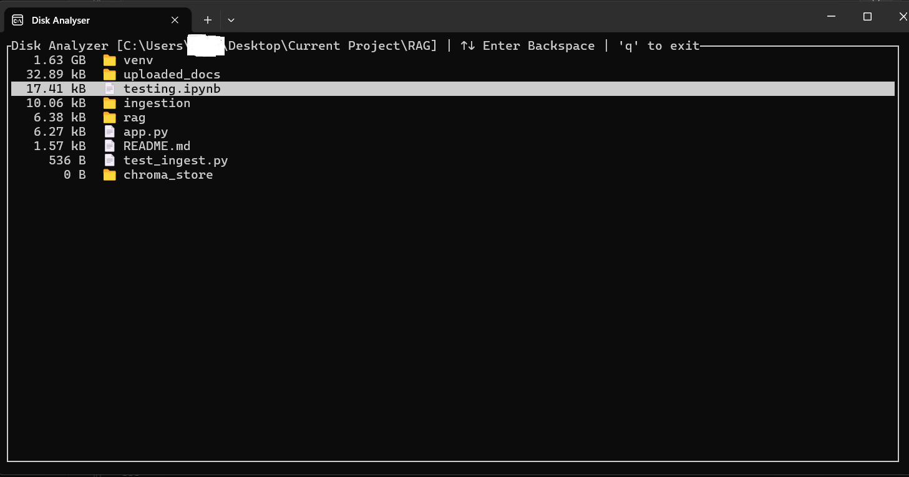

# Disk Analyzer

---

## What is this?

Disk Analyzer is a fast, lightweight terminal-based tool built to help you quickly identify what is taking up space on your Windows system.

Unlike the default Windows file explorer, which can be slow and inefficient when analyzing large directories, this tool is designed for speed and clarity. It scans directories recursively and helps you pinpoint large files and folders so you can decide what to delete and free up space efficiently.

Note: This is only for windows.

---

## How to run

Download the .exe file from releases
Click [here](https://example.com) to go to releases page

### Option 1: Run via executable

1. Run the executable. Done!

2. Double-click disk-analyzer.exe  

3. The program will prompt:
`
Add DIRECTORY to scan:~

You can then paste or type the directory path manually.
`

---

### Option 2: Run from command line

You can run the tool by passing a directory path:

disk-analyzer.exe -- "C:\Users\YourName\Desktop\YourFolder"

This will start scanning the specified directory immediately.

---

---

## Contributions

Contributions, improvements, and suggestions are welcome.  
Feel free to open issues or submit pull requests to help improve performance, usability, or features.

---

## Thank you

Thank you for using Disk Analyzer.

If you found this useful, please consider leaving a star ⭐ on the repository. It helps support the project and motivates further development.